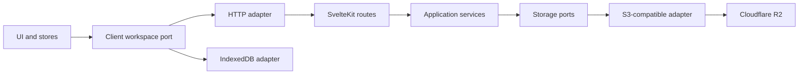

# Personal Notes


A public Markdown notes reader with authenticated S3-compatible storage and a private browser workspace for guests.

## Features

- Milkdown Crepe Markdown editor
- Public document and image reading
- Password-protected server writes
- Guest workspace persisted in IndexedDB
- S3-compatible storage through Ports and Adapters
- Cloudflare R2, AWS S3, MinIO, and compatible provider support
- Fuzzy search, hierarchical navigation, and configurable themes

## Architecture

The SvelteKit routes call application services, which depend only on storage ports. Provider SDK types are restricted to `src/lib/server/adapters/s3`.



Changing between S3-compatible providers only requires environment changes. A non-S3 provider can be added by implementing `DocumentStoragePort` and `AssetStoragePort`, without changing routes or application services.

## Requirements

- Node.js 20.19+ or 22.12+
- An S3-compatible bucket
- Private access credentials with object read and write permissions
- A strong shared access password

## Setup

```bash
npm install
cp .env.example .env
npm run dev
```

Open [http://localhost:5173](http://localhost:5173).

## Environment

```env
S3_ENDPOINT=https://ACCOUNT_ID.r2.cloudflarestorage.com
S3_REGION=auto
S3_BUCKET=personal-notes
S3_ACCESS_KEY_ID=
S3_SECRET_ACCESS_KEY=
S3_FORCE_PATH_STYLE=false
PASSWORD_ACCESS=
SESSION_SECRET=
```

| Variable               | Required | Description                                 |
| ---------------------- | -------- | ------------------------------------------- |
| `S3_ENDPOINT`          | Yes      | Provider S3 API endpoint                    |
| `S3_REGION`            | Yes      | Use `auto` for Cloudflare R2                |
| `S3_BUCKET`            | Yes      | Bucket containing `docs/` and `images/`     |
| `S3_ACCESS_KEY_ID`     | Yes      | Private API access key                      |
| `S3_SECRET_ACCESS_KEY` | Yes      | Private API secret                          |
| `S3_FORCE_PATH_STYLE`  | No       | Enable for providers such as local MinIO    |
| `PASSWORD_ACCESS`      | Yes      | Password accepted by the write-access modal |
| `SESSION_SECRET`       | Yes      | Random 32-byte secret used to sign sessions |

Configure the same variables as encrypted environment variables in Vercel. The bucket can remain private because public reads are proxied by the application.

## Access Modes

All visitors can read documents. The first attempt to edit, create, rename, delete, or upload opens the access modal.

- `Acessar como convidado`: changes stay in that browser's IndexedDB.
- `Autenticar`: the password is checked on the server and creates a signed, `HttpOnly`, seven-day cookie.

Guest changes and authenticated R2 data are intentionally separate. Authentication does not publish or delete the guest workspace.

All mutation endpoints are independently protected in `src/hooks.server.ts`; the modal is not treated as a security boundary. Configure rate limiting for `/api/auth/login` in Vercel Firewall.

## Migration

The migration reads `src/lib/docs` and `.github/images`, uploads them under `docs/` and `images/`, rewrites legacy GitHub image URLs in uploaded Markdown, and verifies the resulting object keys.

```bash
npm run migrate:s3 -- --dry-run
npm run migrate:s3
```

The default mode refuses to overwrite existing objects. Use `--overwrite` only after reviewing the bucket contents:

```bash
npm run migrate:s3 -- --overwrite
```

Remove `src/lib/docs` only after migration and production reads have been verified. This repository intentionally keeps the source files until that operation has been completed with real credentials.

## API

Public routes:

| Method | Endpoint                | Description                         |
| ------ | ----------------------- | ----------------------------------- |
| `GET`  | `/api/docs`             | List Markdown objects               |
| `GET`  | `/api/docs/[...path]`   | Read a Markdown object              |
| `GET`  | `/api/images/[...path]` | Read an image object                |
| `GET`  | `/api/auth/session`     | Read the current session state      |
| `POST` | `/api/auth/login`       | Authenticate with `PASSWORD_ACCESS` |
| `POST` | `/api/auth/logout`      | Clear the session                   |

Authenticated mutation routes:

| Method   | Endpoint            | Description                   |
| -------- | ------------------- | ----------------------------- |
| `PUT`    | `/api/save`         | Create or update a document   |
| `PUT`    | `/api/rename`       | Rename a document or folder   |
| `DELETE` | `/api/delete`       | Delete a document or folder   |
| `POST`   | `/api/upload`       | Upload an image, maximum 5 MB |
| `DELETE` | `/api/deleteImages` | Delete unused images          |

## Development

```bash
npm run dev
npm run test
npm run check
npm run lint
npm run build
```

## Tech Stack

- SvelteKit 2 and Svelte 5
- TypeScript
- Tailwind CSS 4
- Milkdown Crepe
- AWS SDK S3 client
- IndexedDB
- Vitest
